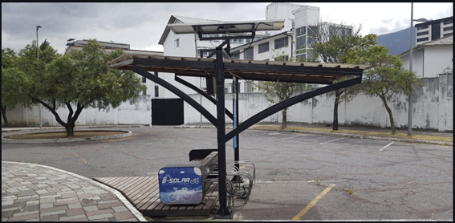
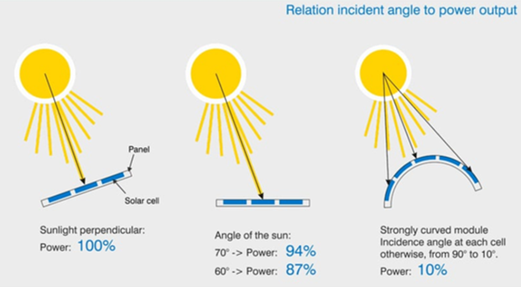
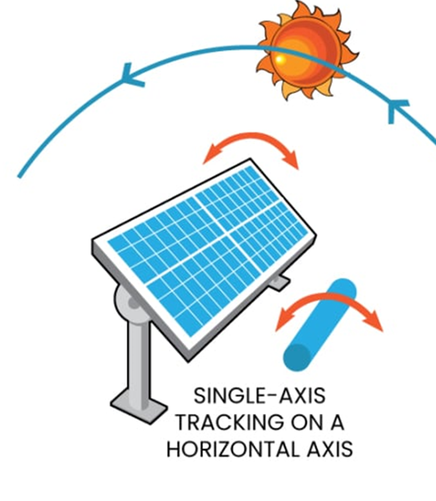
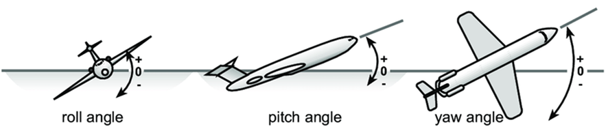
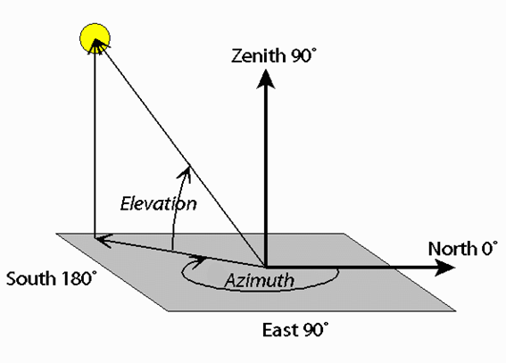

# Proyecto del seguidor solar

La facultad de Ingeniería Mecánica dispone de varios sistemas sistemas de seguimiento solar, uno de ellos se muestra en la siguiente fotografía:  

# ¿Qué es un seguidor solar?
Un seguidor solar es un sistema de orientación para maximizar la exposición a la luz solar. Esto se consigue cuando el panel solar se orienta perpendicularmente a la luz solar incidente. Cuando el panel no se encuentra perpendicular, la cantidad de energía generada disminuye significativamente.  
  

## Angulos de control del seguidor solar
### 1. roll:ángulo de giro alrededor del eje que mira al norte.

  
### 2. pitch: ángulo de giro alrededor del eje que mira al este.
[IMPORTANTE] A diferencia de otro tipo de seguidores solares, la EPN tiene un seguidor solar alrededor del ángulo pitch, en lugar del yaw.
  

# Posicion Solar
La posición del sol se mide con respecto a dos ángulos:
. θ que es el ángulo de elevación del sol con respecto a su proyección en la superficie,
. α que es el ángulo azimutal de la proyección del sol en la superficie con respecto al norte.
  

# Presentación
En el siguiente link podran observar la presentacion de la exposición, en la cual se mostrara cosas como el planteamiento matemámatico, diagrama de flujo del programa implementado, y capturas de la compilacion del mismo.

# Caso de prueba
Se grabó un video acerca del funcionamiento del programa, se observara algunos casos de prueba. 
![alt text]_(assets/Computación.mp4)
[Descargar video de compilación](./assets/compilacion.mp4)
